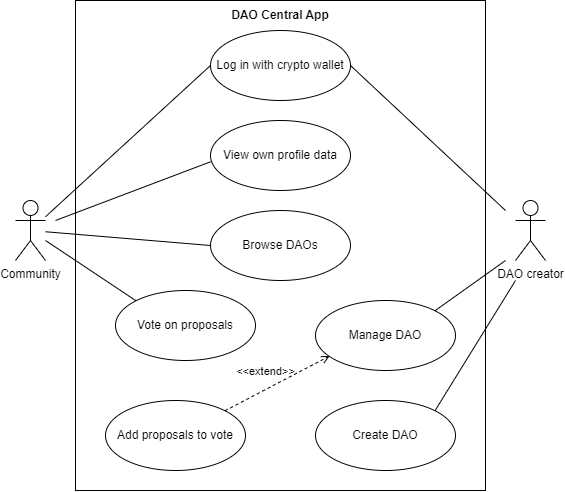
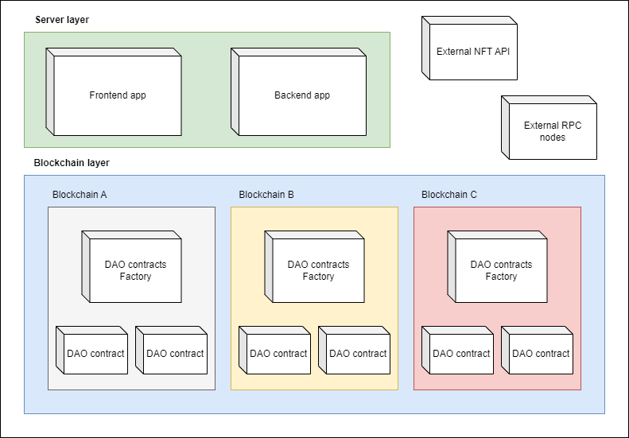
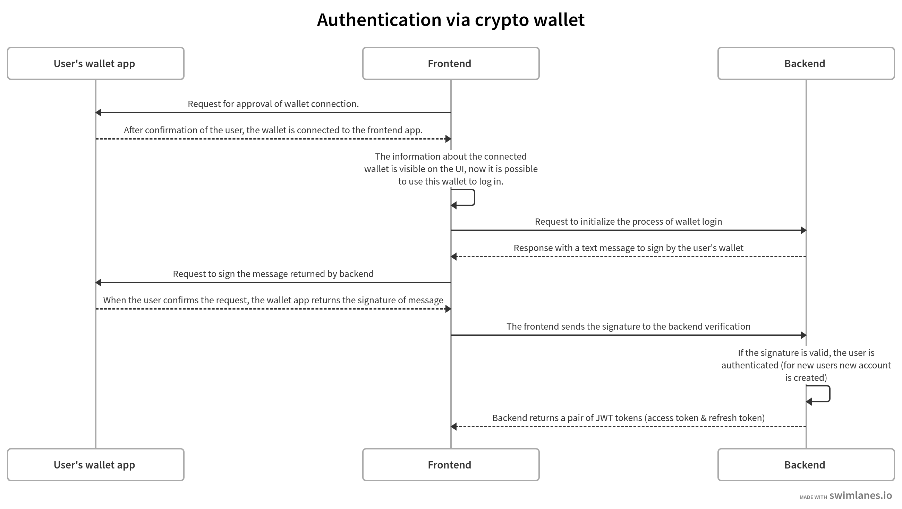
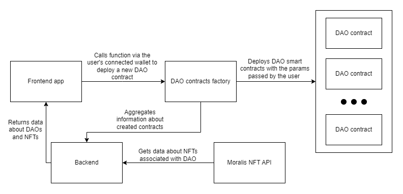

# DAO CENTRAL

## Introduction

DAO Central is the decentralized application powered by blockchain technology for creating and managing DAOs (decentralized autonomous organizations). DAO creators can add proposals pertaining to the organization and allow the community to participate in the decision-making process by casting votes.

Currently, the platform supports creating DAOs for communities built around an NFT collection. The user is recognized as a community member if he is a holder of NFTs from the collection. The smart contracts of DAO verify balance of NFTs on the user's wallet and allows to participate in votings only for community.

**Learn more about DAOs:**

- [Decentralized Autonomous Organization (DAO): Definition, Purpose, and Example](https://www.investopedia.com/tech/what-dao/)
- [Decentralized autonomous organizations (DAOs) - ethereum.org](https://ethereum.org/en/dao/)

## Use cases

## Architecture

### Frontend app

The frontend app is being developed in [Next.js](https://nextjs.org/) and [TypeScript](https://www.typescriptlang.org/). The beta features of Next like the "app directory" was enabled to learn and test the new version of the framework.

[Wagmi](https://wagmi.sh/) and [RainbowKit](https://www.rainbowkit.com/) libraries were used to handle smart contracts interactions and integration with wallets including:

- [MetaMask](https://metamask.io/)
- [CoinBase Wallet](https://www.coinbase.com/pl/wallet)
- [WalletConnect](https://walletconnect.com/)
- [Trust Wallet](https://trustwallet.com/)
- And more

### Backend app

The REST API application is built in [NestJS framework](https://nestjs.com/) and [TypeScript](https://www.typescriptlang.org/). The [MySQL database](https://www.mysql.com/) is used to store data with [TypeORM library](https://typeorm.io/) to integrate it with application

### Smart contracts

The smart contracts are written in the [Solidity language](https://soliditylang.org/) on top of [OpenZeppelin contracts](https://www.openzeppelin.com/contracts).

#### DAO contracts factory (DAOCentralNFTVotingFactory)

The smart contract responsible for deployment of `DAOCentralNFTVoting` contracts while user creates new DAO on the platform. It has to be deployed on each supported blockchain.

The list of supported blockchains:

- Ethereum
- Goerli
- Binance Smart Chain
- Binance Smart Chain Testnet
- Polygon
- Mumbai

#### DAO contract (DAOCentralNFTVoting)

The smart contract to handle the single DAO. It provides the following features:

- Adding new proposals by the owner of the organization
- Voting on the proposals for holders of NFT tokens from the connected NFT collection.

### External Services

#### NFT API

[Moralis NFT API](https://moralis.io/api/nft/) - external service to fetch aggregated data about NFT tokens from multiple blockchains.

#### RPC Nodes

External RPC nodes provided by [Infura](https://www.infura.io/platform/infrastructure), [Alchemy](https://www.alchemy.com/supernode), and [Ankr](https://www.ankr.com/remote-procedure-call/)

## Authentication

To log in to the application users need to have a configured crypto wallet. The diagram below presents the exact authentication flow.

> Please note: When a cryptocurrency wallet app is connected to a web app, it is possible to read wallet data, send requests for signing messages, and approve transactions or contract interactions, but the wallet's private key cannot be read. Connecting the wallet is secure. There is no option to perform unauthorized or unconfirmed operations without the user's approval.

## Creating DAO

Prerequisites:

- The user is authenticated
- Connected the wallet to the application with target network set up
- Address of the NFT collection smart contract for organization on the target network

Each logged user can create their own DAO. To do it the user passes an organization name and address of the NFT contract associated with the organization. After it, the new smart contract is deployed for the DAO and information about the organization is visible at the platform.

The process of creating DAO is presented on the diagram below:

## Voting

An owner of DAO can submit a proposal for a vote. The proposal include the description of proposal, start time and end time of voting.

The members of the community (holders of NFT associated with DAO) are eligible to cast their vote. One NFT corresponds to one vote, so if a user has more than one NFT on their wallet the vote power is equal to number of NFTS.
