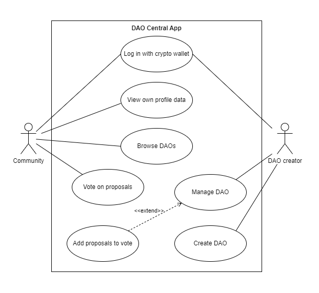

# DAO CENTRAL

## Introduction

DAO Central is the decentralized application powered by blockchain for creating and managing DAOs (decentralized autonomous organizations) technology. DAO creators can add proposals pertaining to the organization and allow the community to vote on them.

**Learn more about DAOs:**

- [Decentralized Autonomous Organization (DAO): Definition, Purpose, and Example](https://www.investopedia.com/tech/what-dao/)
- [Decentralized autonomous organizations (DAOs) - ethereum.org](https://ethereum.org/en/dao/)

## Use cases

## Architecture

### Frontend app

The frontend app is being developed in [Next.js](https://nextjs.org/) and [TypeScript](https://www.typescriptlang.org/). The beta features of Next like the "app directory" was enabled to learn and test the new version of the framework.

[Wagmi](https://wagmi.sh/) and [RainbowKit](https://www.rainbowkit.com/) libraries were used to handle smart contracts interactions and integration with wallets including:

- [MetaMask](https://metamask.io/)
- [CoinBase Wallet](https://www.coinbase.com/pl/wallet)
- [WalletConnect](https://walletconnect.com/)
- [Trust Wallet](https://trustwallet.com/)
- And more

### Backend app

The REST API application is built in [NestJS framework](https://nestjs.com/) and [TypeScript](https://www.typescriptlang.org/). The [MySQL database](https://www.mysql.com/) is used to store data with [TypeORM library](https://typeorm.io/) to integrate it with application

### Smart contracts

The smart contracts are written in the [Solidity language](https://soliditylang.org/) on top of [OpenZeppelin contracts](https://www.openzeppelin.com/contracts).

#### DAO contracts factory (DAOCentralNFTVotingFactory)

The smart contract responsible for deployment of `DAOCentralNFTVoting` contracts while user creates new DAO on the platform. It has to be deployed on each supported blockchain.

The list of supported blockchains:

- Ethereum
- Goerli
- Binance Smart Chain
- Binance Smart Chain Testnet
- Polygon
- Mumbai

#### DAO contract (DAOCentralNFTVoting)

The smart contract to handle the single DAO. It provides the following features:

- Adding new proposals by the owner of the organization
- Voting on the proposals for holders of NFT tokens from the connected NFT collection.

### External Service

#### NFT API

[Moralis NFT API](https://moralis.io/api/nft/) - external service to fetch aggregated data about NFT tokens from multiple blockchains.

#### RPC Nodes

External RPC nodes provided by [Infura](https://www.infura.io/platform/infrastructure), [Alchemy](https://www.alchemy.com/supernode), and [Ankr](https://www.ankr.com/remote-procedure-call/)
